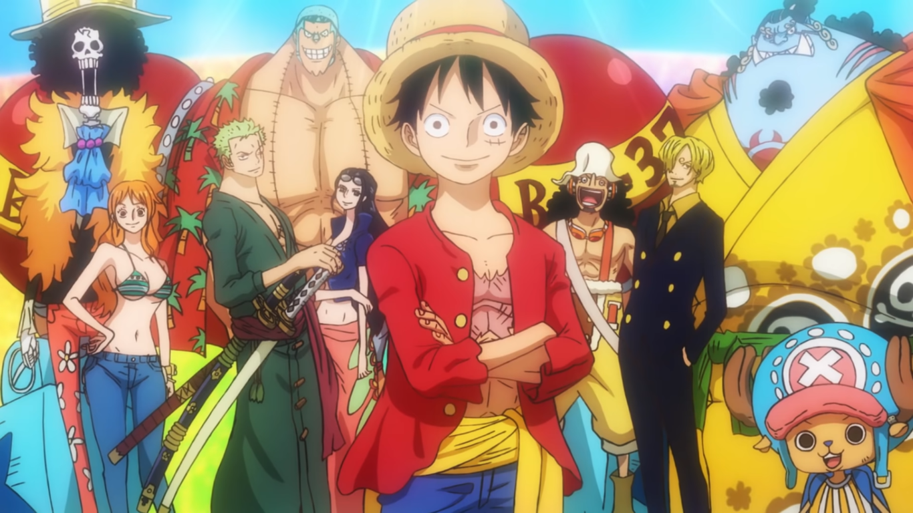

# Andrew Lee, 4th Year CogSci ML
** A15647969 **

My motto:
> Win the day

This past summer, I learned the [dangers](https://www.tecmint.com/10-most-dangerous-commands-you-should-never-execute-on-linux/) of the `rm -rf` command at my internship when a third of my directories/files got deleted because I messed up wild card syntax.

## Things I did over the summer
- Finish  
- Play Chess; ~1700 rapid on Chess.com
- Intern at Clover
- Take CSE 100 and CSE 101
- Gym religously
- Eat like a horse

## 3 things I learned at my internship
1. omormf
2. ofmr
3. 

## Goals for this year
- [ ] 

